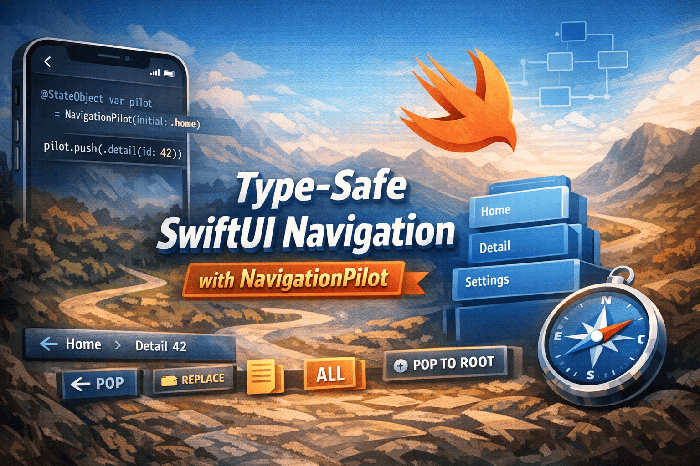
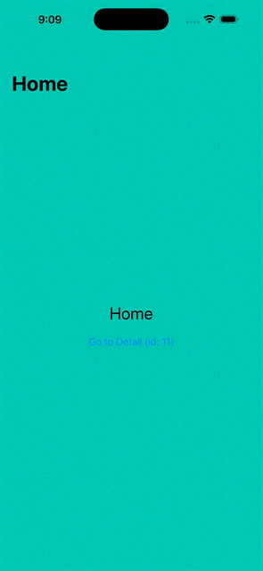
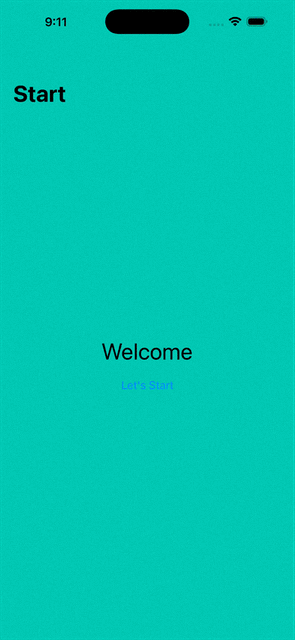

# 🧭 NavigationPilot

<p align="center">
    
</p>

A modern, type-safe navigation library built entirely on SwiftUI's `NavigationStack`. NavigationPilot gives you a clean, router-style API — `push`, `pop`, `popTo`, `replace` — without UIKit, without type erasure, and without writing the same boilerplate across every project.

## ✨ Features

### 🔒 Type-Safe Routing
- **Enum-driven routes** — define every screen in one place
- **Typed parameters** — pass data through routes with compile-time guarantees
- **Callback routes** — carry closures as route parameters for decoupled navigation

### 🧭 Full Navigation Control
- **`push`** — push one or multiple routes at once
- **`pop`** — pop the top screen, or pop `n` screens in one call
- **`popTo`** — jump directly to any ancestor without stepping back manually
- **`popToRoot`** — clear the stack down to the root in one call
- **`replace`** — replace the entire stack, perfect for post-action flows
- **`replaceCurrent`** — swap the top screen without changing stack depth

### 🔁 Native Swipe-Back Support
- **Gesture sync** — swipe-back updates the pilot's stack automatically via a `Binding`
- **No UIKit** — built entirely on `NavigationStack` and SwiftUI state

### 🌿 Environment Injection
- **`@EnvironmentObject`** — every child view receives the pilot automatically
- **No prop drilling** — navigate from anywhere in the view hierarchy

### 🪆 Nested Pilots
- **Multiple stacks** — create independent pilots for split-screen or multi-pane layouts
- **Scoped environments** — each pilot injects into its own `NavigationPilotHost` subtree

### 📦 Lightweight
- **~100 lines** of library code across two files
- **Zero dependencies** — only imports SwiftUI

### Article
I have also written a detailed article on NavigationPilot explaining the design decisions and every pattern in depth. You can read it here: [Type-Safe SwiftUI Navigation: Building a Better NavigationStack with NavigationPilot](https://medium.com/@dkvekariya/type-safe-swiftui-navigation-building-a-better-navigationstack-with-navigationpilot-ce633e29b565)

## 📱 Screenshots

<table>
  <tr>
    <th width="25%">Ex1 — Push / Pop</th>
    <th width="25%">Ex2 — Parameters</th>
    <th width="25%">Ex3 — Callback</th>
    <th width="25%">Ex4 — Split Screen</th>
  </tr>
  <tr align="center">
    <td></td>
    <td></td>
    <td></td>
    <td></td>
  </tr>
</table>

## 🚀 Getting Started

### Prerequisites

- **Xcode 15.0+** or later
- **iOS 16.0+** deployment target
- **macOS Ventura** or later (for development)

### Installation

#### Swift Package Manager

In Xcode: **File → Add Package Dependencies** and enter:

```
https://github.com/DKVekariya/NavigationPilot
```

Or add it directly to your `Package.swift`:

```swift
dependencies: [
    .package(url: "https://github.com/DKVekariya/NavigationPilot", from: "1.0.0")
]
```

## 💻 Code Structure

```
NavigationPilot/
├── Sources/NavigationPilot/
│   ├── NavigationPilot.swift          # Observable router — push, pop, replace
│   └── NavigationPilotHost.swift      # Root view + NavigationStack binding
├── Examples/NavigationPilotExamples/
│   ├── NavigationPilotExamplesApp.swift   # Change activeExample to 1–4
│   ├── DesignSystem.swift                 # Shared UI components
│   ├── Example1_SimplePushPop.swift       # push / pop / popTo / popToRoot
│   ├── Example2_TypesafeParameters.swift  # Typed struct params, replace
│   ├── Example3_CallbackRoute.swift       # Closure as route parameter
│   └── Example4_SplitScreen.swift         # Two independent pilots, vertical split
├── Tests/NavigationPilotTests/
│   └── NavigationPilotTests.swift         # 18 unit tests
├── Package.swift
└── README.md
```

## 🎓 Key Concepts

### Defining Routes

```swift
// Every screen is a case. Parameters are typed — the compiler
// will reject the wrong type at the call site.
enum AppRoute: Hashable {
    case home
    case detail(id: Int)
    case settings
}
```

### Setting Up the Host

```swift
@main
struct MyApp: App {
    @StateObject var pilot = NavigationPilot(initial: AppRoute.home)

    var body: some Scene {
        WindowGroup {
            NavigationPilotHost(pilot) { route in
                switch route {
                case .home:            HomeView()
                case .detail(let id):  DetailView(id: id)
                case .settings:        SettingsView()
                }
            }
        }
    }
}
```

### Navigating from Any View

```swift
// The pilot is injected automatically — no passing through init.
struct HomeView: View {
    @EnvironmentObject var pilot: NavigationPilot<AppRoute>

    var body: some View {
        VStack {
            Button("Open Detail") { pilot.push(.detail(id: 42)) }
            Button("Settings")    { pilot.push(.settings) }
        }
        .navigationTitle("Home")
    }
}
```

### Callback Routes

Carry closures as route parameters to fully decouple destination views from navigation logic:

```swift
enum AppRoute: Hashable {
    case profile(onSignOut: () -> Void)

    // Implement Hashable manually for closure-carrying cases
    func hash(into hasher: inout Hasher) { hasher.combine("profile") }
    static func == (lhs: AppRoute, rhs: AppRoute) -> Bool { true }
}

// SignInView defines the navigation intent at the push call site
pilot.push(.profile(onSignOut: {
    pilot.popTo(.home)
}))

// ProfileView has zero knowledge of NavigationPilot
struct ProfileView: View {
    let onSignOut: () -> Void
    var body: some View {
        Button("Sign Out", role: .destructive) { onSignOut() }
    }
}
```

### Replacing the Stack

Perfect for post-action flows where the back-stack should differ from the forward path:

```swift
// Before: [home → cart → checkout]
// After:  [home → confirmation]
// Swipe-back from confirmation now goes to home, not checkout.
pilot.replace([.home, .confirmation])
```

## 🏗️ Architecture Highlights

### State Management
- Single `@Published` array owns all navigation state
- `public private(set)` enforces that only the pilot mutates the stack
- All operations are safe by default — no guard calls needed at the call site

### NavigationStack Binding
- Root is rendered as the `NavigationStack` content view
- Tail (`stack.dropFirst()`) is bound to the `path` parameter
- Swipe-back gesture updates the binding; `syncTail` reconstructs the full stack

### Environment Scoping
- Each `NavigationPilotHost` injects its typed pilot into its own subtree
- `NavigationPilot<FeedRoute>` and `NavigationPilot<ChatRoute>` resolve independently
- No conflicts in nested or split-screen layouts

## 🎯 API Reference

### Methods

| Method | Description |
|---|---|
| `push(_ route)` | Push one route onto the stack |
| `push(_ routes...)` | Push multiple routes in one call |
| `pop()` | Pop the top route. No-op at root |
| `pop(count: n)` | Pop `n` routes at once, clamped to root |
| `popTo(_ route)` | Pop back to the first occurrence of a route |
| `popToRoot()` | Clear everything above the root |
| `replace(_ routes)` | Replace the entire stack |
| `replaceCurrent(with:)` | Swap only the top-most route |

### Properties

| Property | Type | Description |
|---|---|---|
| `stack` | `[T]` | Read-only live stack. Index 0 is always root |
| `current` | `T?` | Route at the top of the stack |
| `depth` | `Int` | Number of screens in the stack |

## 📚 Examples

Open `NavigationPilotExamplesApp.swift` and change `activeExample` to switch between examples:

```swift
// ▼ Change this number to switch examples ▼
private let activeExample: Int = 1
```

| # | Example | Demonstrates |
|---|---|---|
| 1 | Simple Push / Pop | `push`, `pop`, `popTo`, `popToRoot` |
| 2 | Typesafe Parameters | Typed struct params, `replace`, `replaceCurrent` |
| 3 | Callback Route | Closure passed as a route parameter |
| 4 | Split Screen | Two independent pilots in a vertical split layout |

## 🐛 Known Limitations

- **iOS 16+ / macOS 13+** — requires `NavigationStack`, which is not available on earlier OS versions
- **No animation customisation** — transitions are handled by `NavigationStack` natively
- **No tab bar integration** — tab selection is a separate concern; manage it independently
- **No undo/redo** — not in scope for a routing primitive

## 👨‍💻 Author

**Divyesh Vekariya**
- GitHub: [@DKVekariya](https://github.com/DKVekariya)
- Twitter: [@D_K_Vekariya](https://x.com/D_K_Vekariya)
- LinkedIn: [Divyesh Vekariya](https://www.linkedin.com/in/dkvekariya)

## 🙏 Acknowledgments

- Inspired by [UIPilot](https://github.com/canopas/UIPilot) by Canopas
- Built on Apple's `NavigationStack` introduced in iOS 16
- Special thanks to the SwiftUI community

## 📄 License

MIT. See [LICENSE](LICENSE) for details.

---

**Built with ❤️ using SwiftUI**

*Last Updated: April 2026*
